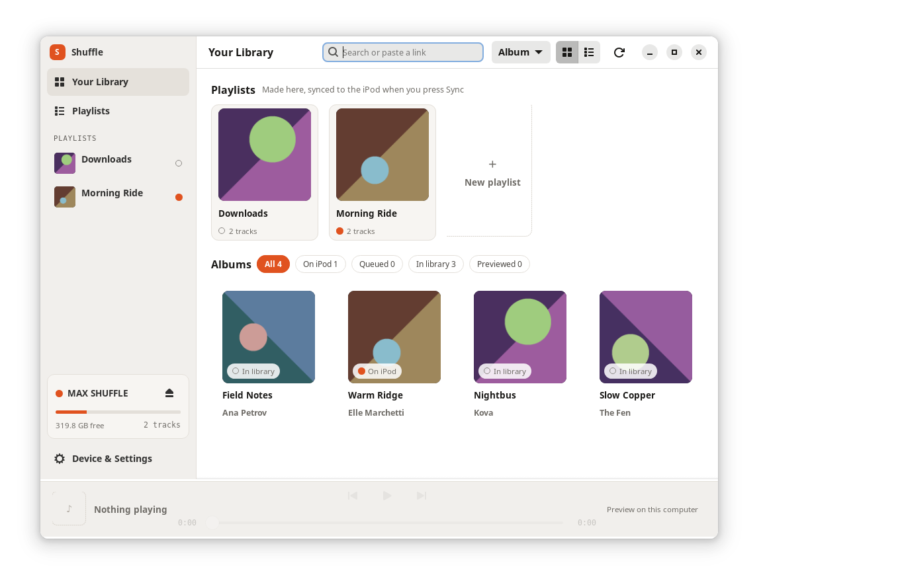
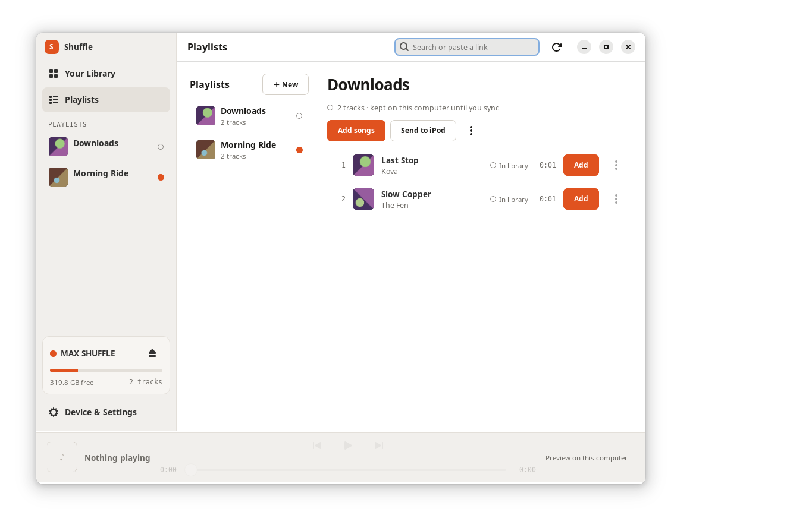
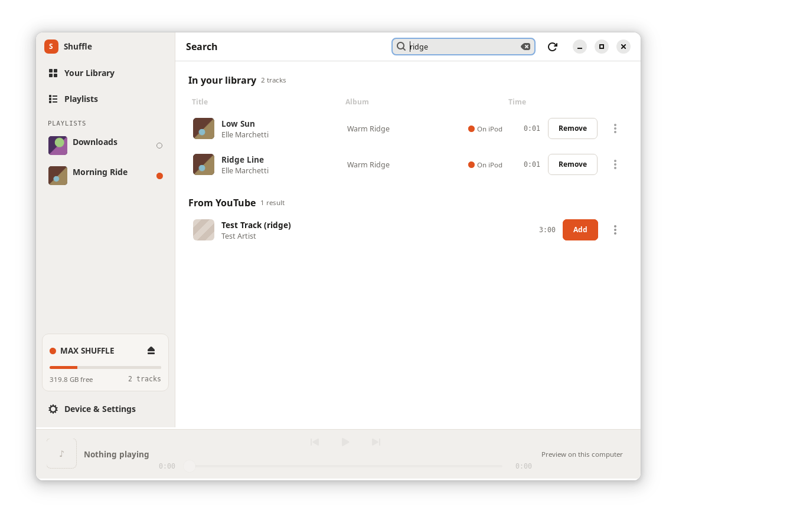
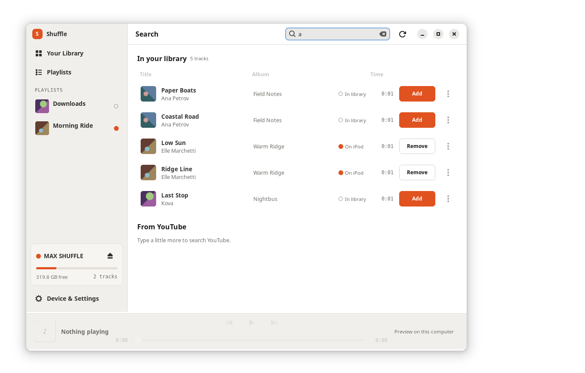
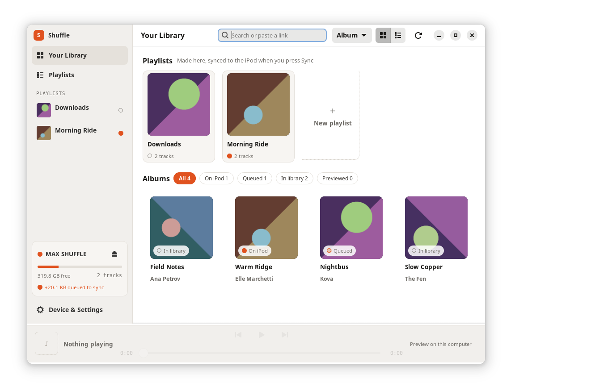
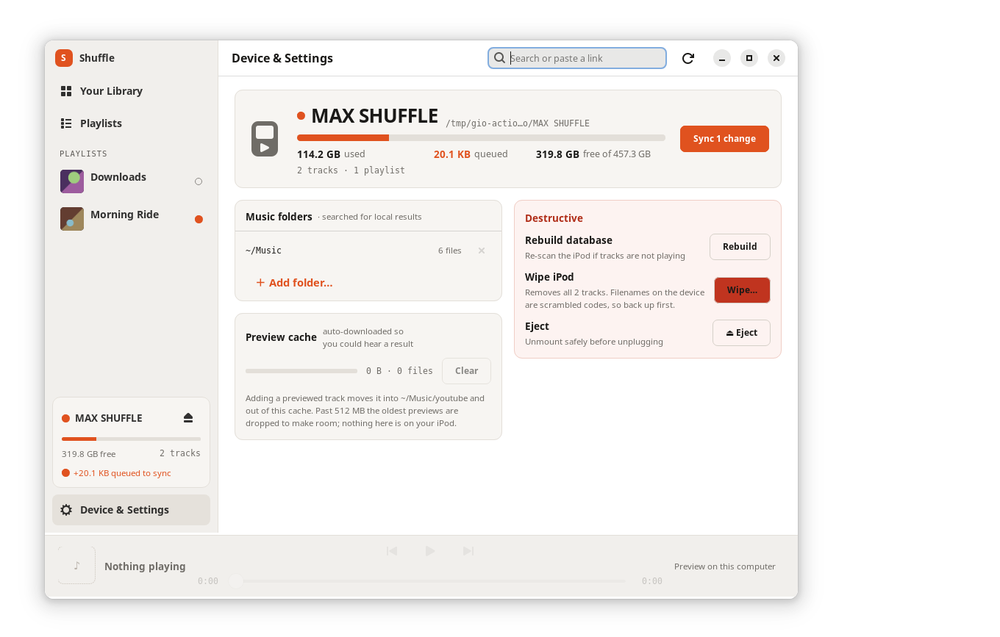
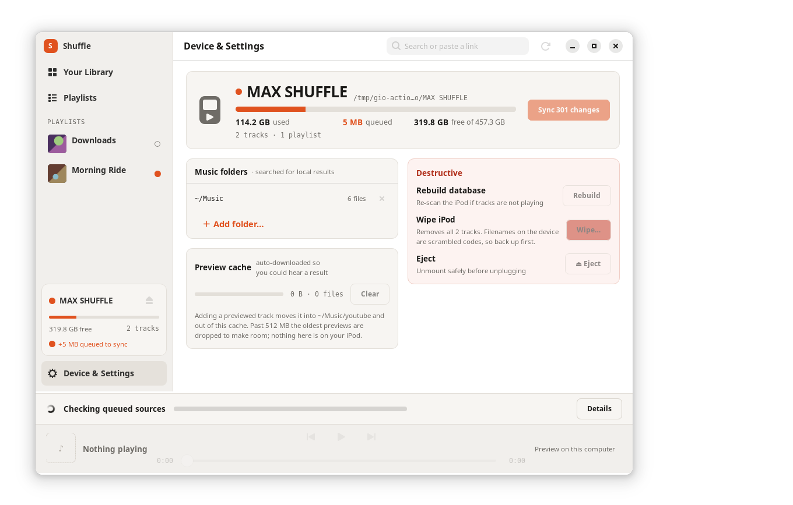
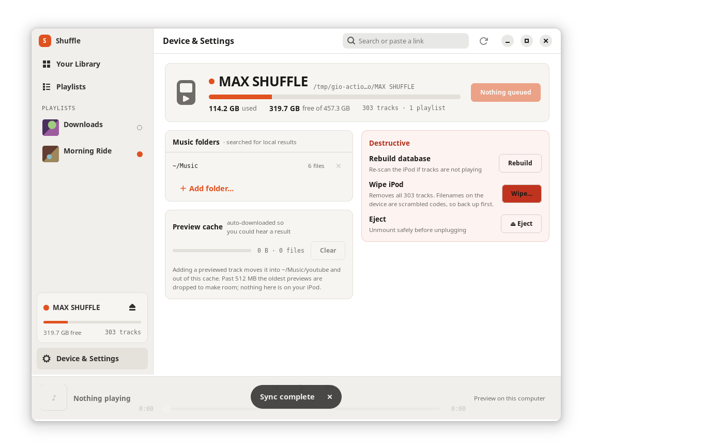

# Driving the running window with gdbus


The actions the running application exports:

```console
$ gdbus call --session --dest io.github.max_miller1204.IpodShuffle --object-path /io/github/max_miller1204/IpodShuffle --method org.gtk.Actions.List
(['refresh', 'navigate', 'dump-state', 'search', 'queue'],)
```

What the window is showing, before anything is asked of it:

```console
$ gdbus call --session --dest io.github.max_miller1204.IpodShuffle --object-path /io/github/max_miller1204/IpodShuffle --method org.gtk.Actions.Activate dump-state '[]' '{}'
()
```
```console
$ gdbus call --session --dest io.github.max_miller1204.IpodShuffle --object-path /io/github/max_miller1204/IpodShuffle --method org.gtk.Actions.Describe dump-state
((true, signature '', [<'{"schema": 1, "page": "library", "visibleCounts": {"ipod": 2, "queued": 0, "library": 4, "preview": 0}, "staged": {"sources": [], "tracks": [], "changes": 0, "bytes": 0, "deviceIdentity": null}, "nowPlaying": {"state": "idle", "track": null, "error": ""}, "sync": {"active": false, "title": "", "current": "", "count": "", "progress": 0.0}, "inlineError": ""}'>]),)
```



navigate: follow a sidebar row from outside the window.

```console
$ gdbus call --session --dest io.github.max_miller1204.IpodShuffle --object-path /io/github/max_miller1204/IpodShuffle --method org.gtk.Actions.Activate navigate '[<"playlists">]' '{}'
()
```
```console
$ gdbus call --session --dest io.github.max_miller1204.IpodShuffle --object-path /io/github/max_miller1204/IpodShuffle --method org.gtk.Actions.Activate dump-state '[]' '{}'
()
```
```console
$ gdbus call --session --dest io.github.max_miller1204.IpodShuffle --object-path /io/github/max_miller1204/IpodShuffle --method org.gtk.Actions.Describe dump-state
((true, signature '', [<'{"schema": 1, "page": "playlists", "visibleCounts": {"ipod": 2, "queued": 0, "library": 4, "preview": 0}, "staged": {"sources": [], "tracks": [], "changes": 0, "bytes": 0, "deviceIdentity": null}, "nowPlaying": {"state": "idle", "track": null, "error": ""}, "sync": {"active": false, "title": "", "current": "", "count": "", "progress": 0.0}, "inlineError": ""}'>]),)
```

  the dump now reports page 'playlists'


navigate: a page name the window has no page under is refused.

```console
$ gdbus call --session --dest io.github.max_miller1204.IpodShuffle --object-path /io/github/max_miller1204/IpodShuffle --method org.gtk.Actions.Activate navigate '[<"bogus">]' '{}'
()
```
```console
$ gdbus call --session --dest io.github.max_miller1204.IpodShuffle --object-path /io/github/max_miller1204/IpodShuffle --method org.gtk.Actions.Activate dump-state '[]' '{}'
()
```
```console
$ gdbus call --session --dest io.github.max_miller1204.IpodShuffle --object-path /io/github/max_miller1204/IpodShuffle --method org.gtk.Actions.Describe dump-state
((true, signature '', [<'{"schema": 1, "page": "playlists", "visibleCounts": {"ipod": 2, "queued": 0, "library": 4, "preview": 0}, "staged": {"sources": [], "tracks": [], "changes": 0, "bytes": 0, "deviceIdentity": null}, "nowPlaying": {"state": "idle", "track": null, "error": ""}, "sync": {"active": false, "title": "", "current": "", "count": "", "progress": 0.0}, "inlineError": ""}'>]),)
```

  the dump still reports page 'playlists'




search: open the search page with a query in the field.

```console
$ gdbus call --session --dest io.github.max_miller1204.IpodShuffle --object-path /io/github/max_miller1204/IpodShuffle --method org.gtk.Actions.Activate search '[<"ridge">]' '{}'
()
```
```console
$ gdbus call --session --dest io.github.max_miller1204.IpodShuffle --object-path /io/github/max_miller1204/IpodShuffle --method org.gtk.Actions.Activate dump-state '[]' '{}'
()
```
```console
$ gdbus call --session --dest io.github.max_miller1204.IpodShuffle --object-path /io/github/max_miller1204/IpodShuffle --method org.gtk.Actions.Describe dump-state
((true, signature '', [<'{"schema": 1, "page": "search", "visibleCounts": {"ipod": 2, "queued": 0, "library": 4, "preview": 0}, "staged": {"sources": [], "tracks": [], "changes": 0, "bytes": 0, "deviceIdentity": null}, "nowPlaying": {"state": "idle", "track": null, "error": ""}, "sync": {"active": false, "title": "", "current": "", "count": "", "progress": 0.0}, "inlineError": ""}'>]),)
```

  the dump reports page 'search'




search: a query too short to ask YouTube, which the page says.

```console
$ gdbus call --session --dest io.github.max_miller1204.IpodShuffle --object-path /io/github/max_miller1204/IpodShuffle --method org.gtk.Actions.Activate search '[<"a">]' '{}'
()
```
```console
$ gdbus call --session --dest io.github.max_miller1204.IpodShuffle --object-path /io/github/max_miller1204/IpodShuffle --method org.gtk.Actions.Activate dump-state '[]' '{}'
()
```
```console
$ gdbus call --session --dest io.github.max_miller1204.IpodShuffle --object-path /io/github/max_miller1204/IpodShuffle --method org.gtk.Actions.Describe dump-state
((true, signature '', [<'{"schema": 1, "page": "search", "visibleCounts": {"ipod": 2, "queued": 0, "library": 4, "preview": 0}, "staged": {"sources": [], "tracks": [], "changes": 0, "bytes": 0, "deviceIdentity": null}, "nowPlaying": {"state": "idle", "track": null, "error": ""}, "sync": {"active": false, "title": "", "current": "", "count": "", "progress": 0.0}, "inlineError": "Type a little more to search YouTube."}'>]),)
```

  the dump reports inlineError 'Type a little more to search YouTube.'




navigate back to the library, which ends the search.

```console
$ gdbus call --session --dest io.github.max_miller1204.IpodShuffle --object-path /io/github/max_miller1204/IpodShuffle --method org.gtk.Actions.Activate navigate '[<"library">]' '{}'
()
```
```console
$ gdbus call --session --dest io.github.max_miller1204.IpodShuffle --object-path /io/github/max_miller1204/IpodShuffle --method org.gtk.Actions.Activate dump-state '[]' '{}'
()
```
```console
$ gdbus call --session --dest io.github.max_miller1204.IpodShuffle --object-path /io/github/max_miller1204/IpodShuffle --method org.gtk.Actions.Describe dump-state
((true, signature '', [<'{"schema": 1, "page": "library", "visibleCounts": {"ipod": 2, "queued": 0, "library": 4, "preview": 0}, "staged": {"sources": [], "tracks": [], "changes": 0, "bytes": 0, "deviceIdentity": null}, "nowPlaying": {"state": "idle", "track": null, "error": ""}, "sync": {"active": false, "title": "", "current": "", "count": "", "progress": 0.0}, "inlineError": ""}'>]),)
```

  inlineError is now ''


queue: stage /tmp/gio-actions-demo/home/Music/Kova/Nightbus for the next sync.

```console
$ gdbus call --session --dest io.github.max_miller1204.IpodShuffle --object-path /io/github/max_miller1204/IpodShuffle --method org.gtk.Actions.Activate queue '[<"/tmp/gio-actions-demo/home/Music/Kova/Nightbus">]' '{}'
()
```
```console
$ gdbus call --session --dest io.github.max_miller1204.IpodShuffle --object-path /io/github/max_miller1204/IpodShuffle --method org.gtk.Actions.Activate dump-state '[]' '{}'
()
```
```console
$ gdbus call --session --dest io.github.max_miller1204.IpodShuffle --object-path /io/github/max_miller1204/IpodShuffle --method org.gtk.Actions.Describe dump-state
((true, signature '', [<'{"schema": 1, "page": "library", "visibleCounts": {"ipod": 2, "queued": 1, "library": 3, "preview": 0}, "staged": {"sources": ["/tmp/gio-actions-demo/home/Music/Kova/Nightbus/01 - Last Stop.mp3"], "tracks": [{"path": "/tmp/gio-actions-demo/home/Music/Kova/Nightbus/01 - Last Stop.mp3", "title": "Last Stop", "artist": "Kova", "album": "Nightbus", "genre": "", "duration": 1.0448979591836736, "trackNumber": 1, "art": "/tmp/gio-actions-demo/home/.cache/ipod-shuffle-linux/art/3ad2d8c962b20efcfb90bffddc849f233e9868cd.img", "size": 20579, "state": "queued", "onIpod": false}], "changes": 1, "bytes": 20579, "deviceIdentity": "uuid:/dev/sdz"}, "nowPlaying": {"state": "idle", "track": null, "error": ""}, "sync": {"active": false, "title": "", "current": "", "count": "", "progress": 0.0}, "inlineError": ""}'>]),)
```

  staged ['/tmp/gio-actions-demo/home/Music/Kova/Nightbus/01 - Last Stop.mp3']


  1 track(s), 1 change(s), 20579 bytes, against 'uuid:/dev/sdz'


  visibleCounts are now {'ipod': 2, 'queued': 1, 'library': 3, 'preview': 0}


queue: cover.jpg is not something a sync can read back.

```console
$ gdbus call --session --dest io.github.max_miller1204.IpodShuffle --object-path /io/github/max_miller1204/IpodShuffle --method org.gtk.Actions.Activate queue '[<"/tmp/gio-actions-demo/home/Music/Kova/Nightbus/cover.jpg">]' '{}'
()
```
```console
$ gdbus call --session --dest io.github.max_miller1204.IpodShuffle --object-path /io/github/max_miller1204/IpodShuffle --method org.gtk.Actions.Activate dump-state '[]' '{}'
()
```
```console
$ gdbus call --session --dest io.github.max_miller1204.IpodShuffle --object-path /io/github/max_miller1204/IpodShuffle --method org.gtk.Actions.Describe dump-state
((true, signature '', [<'{"schema": 1, "page": "library", "visibleCounts": {"ipod": 2, "queued": 1, "library": 3, "preview": 0}, "staged": {"sources": ["/tmp/gio-actions-demo/home/Music/Kova/Nightbus/01 - Last Stop.mp3"], "tracks": [{"path": "/tmp/gio-actions-demo/home/Music/Kova/Nightbus/01 - Last Stop.mp3", "title": "Last Stop", "artist": "Kova", "album": "Nightbus", "genre": "", "duration": 1.0448979591836736, "trackNumber": 1, "art": "/tmp/gio-actions-demo/home/.cache/ipod-shuffle-linux/art/3ad2d8c962b20efcfb90bffddc849f233e9868cd.img", "size": 20579, "state": "queued", "onIpod": false}], "changes": 1, "bytes": 20579, "deviceIdentity": "uuid:/dev/sdz"}, "nowPlaying": {"state": "idle", "track": null, "error": ""}, "sync": {"active": false, "title": "", "current": "", "count": "", "progress": 0.0}, "inlineError": ""}'>]),)
```

  staged is still ['/tmp/gio-actions-demo/home/Music/Kova/Nightbus/01 - Last Stop.mp3']


refresh: re-detect the device and rescan the music folders.

```console
$ gdbus call --session --dest io.github.max_miller1204.IpodShuffle --object-path /io/github/max_miller1204/IpodShuffle --method org.gtk.Actions.Activate refresh '[]' '{}'
()
```


```console
$ gdbus call --session --dest io.github.max_miller1204.IpodShuffle --object-path /io/github/max_miller1204/IpodShuffle --method org.gtk.Actions.Activate dump-state '[]' '{}'
()
```
```console
$ gdbus call --session --dest io.github.max_miller1204.IpodShuffle --object-path /io/github/max_miller1204/IpodShuffle --method org.gtk.Actions.Describe dump-state
((true, signature '', [<'{"schema": 1, "page": "library", "visibleCounts": {"ipod": 2, "queued": 1, "library": 3, "preview": 0}, "staged": {"sources": ["/tmp/gio-actions-demo/home/Music/Kova/Nightbus/01 - Last Stop.mp3"], "tracks": [{"path": "/tmp/gio-actions-demo/home/Music/Kova/Nightbus/01 - Last Stop.mp3", "title": "Last Stop", "artist": "Kova", "album": "Nightbus", "genre": "", "duration": 1.0448979591836736, "trackNumber": 1, "art": "/tmp/gio-actions-demo/home/.cache/ipod-shuffle-linux/art/3ad2d8c962b20efcfb90bffddc849f233e9868cd.img", "size": 20579, "state": "queued", "onIpod": false}], "changes": 1, "bytes": 20579, "deviceIdentity": "uuid:/dev/sdz"}, "nowPlaying": {"state": "idle", "track": null, "error": ""}, "sync": {"active": false, "title": "", "current": "", "count": "", "progress": 0.0}, "inlineError": ""}'>]),)
```

  after the rescan the counts read {'ipod': 2, 'queued': 1, 'library': 3, 'preview': 0}


navigate: the device page, where the Sync button is.

```console
$ gdbus call --session --dest io.github.max_miller1204.IpodShuffle --object-path /io/github/max_miller1204/IpodShuffle --method org.gtk.Actions.Activate navigate '[<"settings">]' '{}'
()
```
```console
$ gdbus call --session --dest io.github.max_miller1204.IpodShuffle --object-path /io/github/max_miller1204/IpodShuffle --method org.gtk.Actions.Activate dump-state '[]' '{}'
()
```
```console
$ gdbus call --session --dest io.github.max_miller1204.IpodShuffle --object-path /io/github/max_miller1204/IpodShuffle --method org.gtk.Actions.Describe dump-state
((true, signature '', [<'{"schema": 1, "page": "settings", "visibleCounts": {"ipod": 2, "queued": 1, "library": 3, "preview": 0}, "staged": {"sources": ["/tmp/gio-actions-demo/home/Music/Kova/Nightbus/01 - Last Stop.mp3"], "tracks": [{"path": "/tmp/gio-actions-demo/home/Music/Kova/Nightbus/01 - Last Stop.mp3", "title": "Last Stop", "artist": "Kova", "album": "Nightbus", "genre": "", "duration": 1.0448979591836736, "trackNumber": 1, "art": "/tmp/gio-actions-demo/home/.cache/ipod-shuffle-linux/art/3ad2d8c962b20efcfb90bffddc849f233e9868cd.img", "size": 20579, "state": "queued", "onIpod": false}], "changes": 1, "bytes": 20579, "deviceIdentity": "uuid:/dev/sdz"}, "nowPlaying": {"state": "idle", "track": null, "error": ""}, "sync": {"active": false, "title": "", "current": "", "count": "", "progress": 0.0}, "inlineError": ""}'>]),)
```



queue: 300 more tracks, from a folder outside every music folder, so that the sync below lasts long enough to be photographed.

```console
$ gdbus call --session --dest io.github.max_miller1204.IpodShuffle --object-path /io/github/max_miller1204/IpodShuffle --method org.gtk.Actions.Activate queue '[<"/tmp/gio-actions-demo/Long Run">]' '{}'
()
```
```console
$ gdbus call --session --dest io.github.max_miller1204.IpodShuffle --object-path /io/github/max_miller1204/IpodShuffle --method org.gtk.Actions.Activate dump-state '[]' '{}'
()
```
```console
$ gdbus call --session --dest io.github.max_miller1204.IpodShuffle --object-path /io/github/max_miller1204/IpodShuffle --method org.gtk.Actions.Describe dump-state
((true, signature '', [<'{"schema": 1, "page": "settings", "visibleCounts": {"ipod": 2, "queued": 301, "library": 3, "preview": 0}, "staged": {"sources": ["/tmp/gio-actions-demo/Long Run/002 - Long Run 2.mp3", "/tmp/gio-actions-demo/Long Run/003 - Long Run 3.mp3", "/tmp/gio-actions-demo/Long Run/004 - Long Run 4.mp3", "/tmp/gio-actions-demo/Long Run/005 - Long Run 5.mp3", "/tmp/gio-actions-demo/Long Run/006 - Long Run 6.mp3", "/tmp/gio-actions-demo/Long Run/007 - Long Run 7.mp3", "/tmp/gio-actions-demo/Long Run/008 - Long Run 8.mp3", "/tmp/gio-actions-demo/Long Run/009 - Long Run 9.mp3", "/tmp/gio-actions-demo/Long Run/01 - Long Run 1.mp3", "/tmp/gio-actions-demo/Long Run/010 - Long Run 10.mp3", "/tmp/gio-actions-demo/Long Run/011 - Long Run 11.mp3", "/tmp/gio-actions-demo/Long Run/012 - Long Run 12.mp3", "/tmp/gio-actions-demo/Long Run/013 - Long Run 13.mp3", "/tmp/gio-actions-demo/Long Run/014 - Long Run 14.mp3", "/tmp/gio-actions-demo/Long Run/015 - Long Run 15.mp3", "/tmp/gio-actions-demo/Long Run/016 - Long Run 16.mp3", "/tmp/gio-actions-demo/Long Run/017 - Long Run 17.mp3", "/t
[… 95125 more characters. The whole document is in the dump-*.json files beside this transcript. It ends:]
e Choir", "album": "Long Run", "genre": "", "duration": 1.0448979591836736, "trackNumber": 0, "art": null, "size": 17245, "state": "queued", "onIpod": false}], "changes": 301, "bytes": 5194079, "deviceIdentity": "uuid:/dev/sdz"}, "nowPlaying": {"state": "idle", "track": null, "error": ""}, "sync": {"active": false, "title": "", "current": "", "count": "", "progress": 0.0}, "inlineError": ""}'>]),)
```

  301 tracks staged, 301 changes, 5194079 bytes


Sync, clicked on the window itself. Starting a sync is the one thing these actions do not do, and the bar it puts up is what the dump's sync half reports on.



```console
$ gdbus call --session --dest io.github.max_miller1204.IpodShuffle --object-path /io/github/max_miller1204/IpodShuffle --method org.gtk.Actions.Activate dump-state '[]' '{}'
()
```
```console
$ gdbus call --session --dest io.github.max_miller1204.IpodShuffle --object-path /io/github/max_miller1204/IpodShuffle --method org.gtk.Actions.Describe dump-state
((true, signature '', [<'{"schema": 1, "page": "settings", "visibleCounts": {"ipod": 2, "queued": 301, "library": 3, "preview": 0}, "staged": {"sources": ["/tmp/gio-actions-demo/Long Run/002 - Long Run 2.mp3", "/tmp/gio-actions-demo/Long Run/003 - Long Run 3.mp3", "/tmp/gio-actions-demo/Long Run/004 - Long Run 4.mp3", "/tmp/gio-actions-demo/Long Run/005 - Long Run 5.mp3", "/tmp/gio-actions-demo/Long Run/006 - Long Run 6.mp3", "/tmp/gio-actions-demo/Long Run/007 - Long Run 7.mp3", "/tmp/gio-actions-demo/Long Run/008 - Long Run 8.mp3", "/tmp/gio-actions-demo/Long Run/009 - Long Run 9.mp3", "/tmp/gio-actions-demo/Long Run/01 - Long Run 1.mp3", "/tmp/gio-actions-demo/Long Run/010 - Long Run 10.mp3", "/tmp/gio-actions-demo/Long Run/011 - Long Run 11.mp3", "/tmp/gio-actions-demo/Long Run/012 - Long Run 12.mp3", "/tmp/gio-actions-demo/Long Run/013 - Long Run 13.mp3", "/tmp/gio-actions-demo/Long Run/014 - Long Run 14.mp3", "/tmp/gio-actions-demo/Long Run/015 - Long Run 15.mp3", "/tmp/gio-actions-demo/Long Run/016 - Long Run 16.mp3", "/tmp/gio-actions-demo/Long Run/017 - Long Run 17.mp3", "/t
[… 95147 more characters. The whole document is in the dump-*.json files beside this transcript. It ends:]
ng Run", "genre": "", "duration": 1.0448979591836736, "trackNumber": 0, "art": null, "size": 17245, "state": "queued", "onIpod": false}], "changes": 301, "bytes": 5194079, "deviceIdentity": "uuid:/dev/sdz"}, "nowPlaying": {"state": "idle", "track": null, "error": ""}, "sync": {"active": true, "title": "Checking queued sources", "current": "", "count": "", "progress": 0.0}, "inlineError": ""}'>]),)
```

  with the bar on screen, sync read {'active': True, 'title': 'Checking queued sources', 'current': '', 'count': '', 'progress': 0.0}

```console
$ gdbus call --session --dest io.github.max_miller1204.IpodShuffle --object-path /io/github/max_miller1204/IpodShuffle --method org.gtk.Actions.Activate dump-state '[]' '{}'
()
```
```console
$ gdbus call --session --dest io.github.max_miller1204.IpodShuffle --object-path /io/github/max_miller1204/IpodShuffle --method org.gtk.Actions.Describe dump-state
((true, signature '', [<'{"schema": 1, "page": "settings", "visibleCounts": {"ipod": 0, "queued": 0, "library": 6, "preview": 0}, "staged": {"sources": [], "tracks": [], "changes": 0, "bytes": 0, "deviceIdentity": null}, "nowPlaying": {"state": "idle", "track": null, "error": ""}, "sync": {"active": false, "title": "", "current": "", "count": "", "progress": 0.0}, "inlineError": ""}'>]),)
```

  when the run finished sync read {'active': False, 'title': '', 'current': '', 'count': '', 'progress': 0.0}


  the counts at that moment read {'ipod': 0, 'queued': 0, 'library': 6, 'preview': 0}

```console
$ gdbus call --session --dest io.github.max_miller1204.IpodShuffle --object-path /io/github/max_miller1204/IpodShuffle --method org.gtk.Actions.Activate dump-state '[]' '{}'
()
```
```console
$ gdbus call --session --dest io.github.max_miller1204.IpodShuffle --object-path /io/github/max_miller1204/IpodShuffle --method org.gtk.Actions.Describe dump-state
((true, signature '', [<'{"schema": 1, "page": "settings", "visibleCounts": {"ipod": 303, "queued": 0, "library": 3, "preview": 0}, "staged": {"sources": [], "tracks": [], "changes": 0, "bytes": 0, "deviceIdentity": null}, "nowPlaying": {"state": "idle", "track": null, "error": ""}, "sync": {"active": false, "title": "", "current": "", "count": "", "progress": 0.0}, "inlineError": ""}'>]),)
```

  and once the window had finished re-reading the iPod, {'ipod': 303, 'queued': 0, 'library': 3, 'preview': 0}




The staged track, as the state dump writes it and as the headless CLI writes it.


  same fields: True; same values apart from where the track lives: True

```console
$ gdbus call --session --dest io.github.max_miller1204.IpodShuffle --object-path /io/github/max_miller1204/IpodShuffle --method org.gtk.Actions.Activate dump-state '[]' '{}'
()
```
```console
$ gdbus call --session --dest io.github.max_miller1204.IpodShuffle --object-path /io/github/max_miller1204/IpodShuffle --method org.gtk.Actions.Describe dump-state
((true, signature '', [<'{"schema": 1, "page": "settings", "visibleCounts": {"ipod": 303, "queued": 0, "library": 3, "preview": 0}, "staged": {"sources": [], "tracks": [], "changes": 0, "bytes": 0, "deviceIdentity": null}, "nowPlaying": {"state": "idle", "track": null, "error": ""}, "sync": {"active": false, "title": "", "current": "", "count": "", "progress": 0.0}, "inlineError": ""}'>]),)
```
