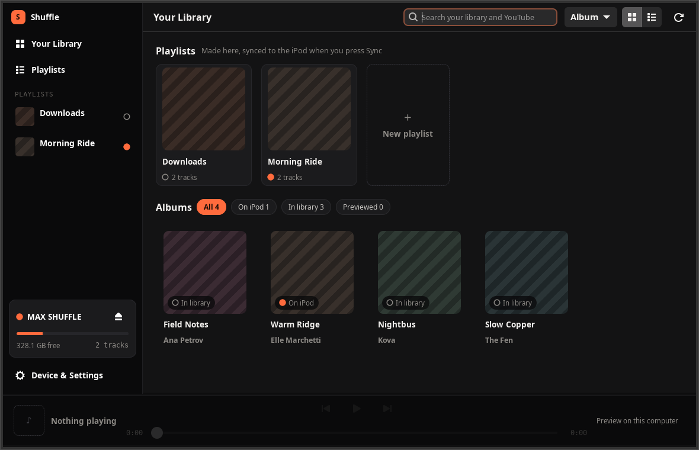
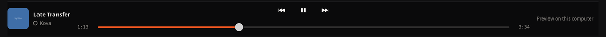

# ipod-shuffle-linux

Use an iPod shuffle 4th generation on Linux without iTunes.

A GTK4 app and a set of scripts to wipe, load, and manage a shuffle 4G, with the device details that make the process work.

## Why this is not just drag and drop

The shuffle 4G does not play files you copy onto it.

It plays only what is listed in `iPod_Control/iTunes/iTunesSD`, a binary database that the firmware reads at startup.
Copy an MP3 onto the volume without updating that database and the player ignores it completely.
iTunes normally writes this file, which is why the device appears to be locked to Apple's software.

`iTunesSD` has been reverse engineered, so a small Python tool can write it instead.
That is the entire trick: copy audio, rebuild the database, unmount.

Rockbox is not an alternative here.
It does not support any iPod shuffle model, so replacing the firmware is not an option and the database has to be written in Apple's format.

## Supported hardware

Built and tested against the iPod shuffle 4th generation, USB ID `05ac:1303`.

That is the small square model with a clip on the back, a circular control pad, and no screen at all.
If your device has a display it is a nano, not a shuffle, and it uses a different database format that these scripts do not write.

Confirm what you have before starting:

```bash
lsusb | grep -i apple
```

The 3rd generation shuffle uses the same database format and will probably work, but has not been tested.

## Setup

```bash
git clone https://github.com/max-miller1204/ipod-shuffle-linux.git
cd ipod-shuffle-linux
./install.sh
```

That handles the core installation.
It fetches the database builder into `~/ipod-tools/`, creates a virtualenv for the Python dependencies, installs an app-grid entry for the GUI, and offers to install compatible missing system packages.
A missing JavaScript runtime is reported with a link to its manual setup guide instead; see [Downloading from YouTube](#downloading-from-youtube).

The only hard requirements are Python 3 and git.
Everything else is installed or reported for you:

| Component | Where it goes | Gives you |
| --- | --- | --- |
| `mutagen` | virtualenv | Artist and album metadata, including tag-based playlists |
| `yt-dlp` | virtualenv | Downloading music from YouTube via `ipod-fetch.sh` |
| `python3-gi`, `gir1.2-gtk-4.0`, `gir1.2-adw-1` | system | The graphical interface |
| `libttspico-utils` | system | Spoken track and playlist names via VoiceOver |
| `ffmpeg` | system | Converting FLAC, OGG, and other unsupported formats, including YouTube's Opus |
| [GStreamer](#preview-playback) | system | Previewing a track through this computer's speakers |
| [Supported JavaScript runtime](#downloading-from-youtube) | system | Solving YouTube's signature challenge |

Run `./install.sh --no-system` to set up the virtualenv only and be told what to install by hand.
System packages are never installed without asking, and the privileged step goes through `pkexec` so it prompts through the desktop rather than needing a terminal.

### Why not put everything in the virtualenv

It is a fair question, and the answer differs per dependency.

`mutagen` is pure Python, so it goes in the virtualenv and needs no privileges at all.

PyGObject cannot.
Building it from pip requires the gobject-introspection and cairo development headers, so pip-installing it would mean adding three `-dev` system packages in order to avoid adding one runtime package.
GTK4 itself is a C library that no virtualenv can contain.
The distro's `python3-gi` is smaller, already built, and better tested.

GStreamer is reached through those same bindings, so its typelib belongs to the system Python too.
Its plugins are native libraries rather than Python packages, and a virtualenv cannot contain them.

`pico2wave` and `ffmpeg` are plain binaries rather than Python packages, so they have no virtualenv to go in either.

This split is why `ipod-gui.sh` looks for an interpreter that can import GTK instead of assuming the one on PATH, and why the GUI reads tags by calling into the virtualenv as a subprocess.

### Why mutagen goes in a virtualenv rather than apt

`mutagen` supplies the artist and album metadata written into the database, and `install.sh` installs it into `~/ipod-tools/venv` rather than through apt.

That is deliberate.
The `python3` first on your PATH is not necessarily the one apt installs into.
If you use uv, pyenv, conda, or Homebrew, your `python3` cannot see `/usr/lib/python3/dist-packages` at all, so `sudo apt install python3-mutagen` completes successfully while the database builder still reports `No mutagen found`.
Owning a virtualenv sidesteps both that and PEP 668's externally-managed-environment error.

## Graphical interface

```bash
./ipod-gui.sh
```

Or launch **iPod Shuffle** from the desktop's app grid; `install.sh` puts the entry there once the GTK dependencies are available.
The entry embeds the checkout's location, so if you move the repository, re-run `./install.sh` to update it.



The window is library-first: your music is the app, and the device operations live in one **Device & Settings** view rather than leading the window.
It detects the iPod automatically, appearing and updating as the device is plugged in or unmounted, and it shows real song titles, artists and embedded cover art rather than the scrambled filenames stored on the device.
Nothing it reads off the device happens where the window draws: detection, the playlists, the track count and the free space are gathered on a worker thread, so plugging in a full 2GB shuffle never freezes the window, and the library, search and preview playback stay usable throughout.

Your own music folders are indexed alongside whatever is on the iPod, so **Your Library** shows both together as one album grid.
A coloured marker on every album and track says which of four states it is in, and that marker means the same thing everywhere it appears:

| Marker | State | Meaning |
| --- | --- | --- |
| Filled | On iPod | Synced, and plays on the device |
| Ringed | Queued | Staged for the next **Sync**, still only on this computer |
| Hollow | In library | On this computer, not yet synced |
| Dashed | Previewed only | Downloaded just so it could be heard, never added |

*Previewed only* is what previewing a YouTube result produces: the file is kept in a cache outside your music folders until you add it, so hearing twenty songs does not add twenty of them to your library.
*Queued* is not a place the file is - it sits in your music folder like any other, or outside them all when a download landed somewhere no music folder covers - but a sync that is coming, so its marker is filled in the colour the storage meter shows that same change in, and ringed like a track that has already reached the device.

An album counts as *On iPod* only when all of it is, because a half-synced album badged otherwise would be a lie the shuffle gives you no way to investigate.
*Queued* follows that rule one step earlier: an album is queued when the next sync will leave all of it on the device, so one staged track out of twelve leaves the record itself *In library*.
The table is the view that answers track by track, and its pills count and filter tracks rather than albums.

Adding no longer copies immediately.
Queueing an album or a track shows it as pending space in the storage meter, marks it *Queued* wherever it appears, and one **Sync** button commits the batch, so a session's worth of changes costs a single database rebuild instead of one per track.
A staged track's own button becomes **Unqueue**, which takes back out whatever staged it: a track you queued on its own leaves on its own, and one that joined the queue as part of a playlist or a folder takes that whole list or folder with it.
That is what the button is for - a playlist queued by mistake is otherwise a hundred tracks to take back one at a time - and the sync is a batch you are still assembling, so nothing has been copied either way.
The copy reports each file as it lands, which a 2GB device over USB 2.0 badly needed: the progress bar, the file list and the raw script output all sit in a bar above the player.

The grid groups by album or by artist, and swaps for a sortable table of every track: click a column to sort by title, album, state or length.
Both choices are remembered, so the app reopens on the view you left it in rather than back on the album grid.
The state pills count and filter the collections shown in the grid, or the individual tracks shown in the table, so their totals always describe the active view.

The `⋯` beside a track ends with **Delete from library…**, which is the only thing in the window that touches your own music files.
It asks first, and the dialog says what the deletion leaves behind before it happens: the file is moved to your wastebasket, the copy on the iPod stays there until you remove it, a staged track is taken back out of the next sync, and a playlist listing it keeps that line, where it will name a file that is no longer there.
Where **Unqueue** is the wide press, this is the narrow one: only that song leaves the queue, and a playlist or a folder staged around it stays staged, just without that one song.
It is offered only for songs this computer holds.
A track that exists only on the iPod is taken off it with the row's own **Remove**, and a previewed one lives in the cache **Device & Settings** empties in one press, so neither is a file this deletes.
On a volume with nowhere to trash to, the deletion is refused and the app says why rather than unlinking the file behind the same word.

Local music folders are configurable under **Device & Settings**, which is also where the preview cache, **Rebuild database**, **Wipe** and **Eject** live.
That page has no options of its own: every sync asks for spoken track and playlist names and groups nothing automatically, so the playlists on the device are the ones you put there.
The only thing the page says about it is when this machine has no speech engine to generate the recordings with, which it warns about at the top.
Adding a folder of music is one press there and nothing else to decide: its songs join the library, and the ones you want go in the queue from **Your Library** like any others.

Making a playlist is a name and nothing else.
**＋ New** under **Playlists** offers the next free *Playlist N*, and the list exists the moment you accept it: there is no file to choose, no iPod to have plugged in, and no sync to wait for.
It is kept as an M3U in `~/Music/Playlists`, so it outlives this app and other players can read it.

Songs go in from the `⋯` beside any track, in the library, on an album page, or in either half of the search results - including a YouTube result, which downloads first and lands in the playlist when it finishes.
An album page also has **Add to playlist**, which puts the whole record in at once.
Inside a playlist the same menu moves a track to another playlist or takes it out again, which leaves the song itself alone in your library and on the iPod.
Tracks can also be dragged into a new order, and that order is the playlist, so it is written to the file rather than kept in the window.

Every edit stages the playlist and its songs for the next sync, and **Sync** copies them and writes the list onto the device under its own name.
Editing with no iPod attached is fine - **Send to iPod** stages it whenever one turns up.
Because the device stores playlist names only as spoken audio, every sync asks for them; without a speech engine installed to generate the recordings the playlist stays on this computer, and the page says so.
The dot beside a playlist means what it means beside a track: on the iPod, or here and waiting to be.
A playlist wears the first cover the songs in it carry, so a list made out of records you have artwork for looks like those records rather than like a coloured tile.

**Rename…**, under the same `⋯`, is one change here and two on a device already holding the playlist, since the name is what the iPod says out loud: the old name comes off the device as you accept it, and the new one goes on at the next sync, which the confirmation says before it happens.
That second half needs a speech engine like any other playlist reaching the device, so without one a rename that has a new name to stage is refused rather than confirmed - it would take the playlist off the iPod with nothing able to put it back, **Send to iPod** included.
Install an engine and the rename is available again, and it was never refused for a playlist the iPod is not holding, nor for one listing no tracks, which has no second half to it.

The **Playlists** view also lists the playlists that exist only on the device - a folder or tag grouping a sync generated, a list made on another computer, or one a sync run from the terminal put there.
Those are shown, reordered and removed but not edited, because their entries name copies on the iPod rather than files in your music folders, and for the same reason they are not among the playlists a track's `⋯` offers to add a song to.
Every menu that offers playlists names the ones it is leaving out, so a playlist missing from it is never missing silently.

**Copy to this computer**, on such a playlist's page, is the way out of that.
The library has already worked out which of your files each copy on the device was made from, so the list is written down again in terms of this computer as an M3U in `~/Music/Playlists`, and from then on it is an ordinary playlist you can add songs to, reorder and rename.
Copying stages nothing: the iPod is already holding this playlist, so the copy asks for no change over there.
A song this computer cannot account for - one that reached the iPod from a machine you no longer have, or that has since been deleted here - is counted in the line above the buttons and spelled out in a confirmation before anything is written, because the copy is what a later sync writes back and the tracks it leaves out would leave the playlist on the device.
The songs themselves stay on the iPod either way.
While your music folders or the iPod are still being read, that count is not stated and the copy is not offered: both readings arrive a batch at a time, and a figure taken from half of one would offer a copy shorter than the playlist actually is.
Taking such a playlist off the device is under the `⋯` beside the copy, which is where a playlist made here keeps its own **Delete**.

Neither kind of playlist is sortable by column: a playlist's order is the one thing you arranged by hand, and offering to sort it by title would throw that away.

A playlist another program wrote is adopted by copying the `.m3u` into `~/Music/Playlists`, which is the folder the window reads: press the refresh button in the header and it is there among your own, an ordinary playlist you can edit from then on.
Its entries have to be absolute paths to files this computer holds, since nothing rewrites them on the way in: a relative entry is read against `~/Music/Playlists` rather than the folder the list came from, and an entry naming a file that is not there is a line that finds nothing.
Only `.m3u` is read, so a `.pls` does not appear in the window at all until it is converted.

The search field at the top of the window queries two sources at once.
Your indexed music folders answer immediately, matching every word of the query in any order across title, artist and album, so "queen rhapsody" finds a track tagged *Bohemian Rhapsody* by *Queen*.
For queries of at least two characters, YouTube answers a second or so later with up to three matches; a reserved three-row placeholder keeps the page steady while it waits.
Hovering a result's artwork turns it into a play button, the same as a track you already have, and pressing it downloads that video into the preview cache and plays it.
Once an iPod is connected, adding one of those results downloads it as MP3 and queues it, the same as pasting its link would.

Pasting a link into the search field looks that link up rather than searching for its text, so you can see what a URL actually is before adding it.
The field says so - it reads **Search or paste a link**, and its tooltip names both sources.

A link to a playlist gets a header above the results naming it and saying how long it really is, along the lines of *Playlist: Road Trip, 40 tracks, showing the first 3*, with **Add all** beside it.
Only three rows are ever listed, so that an album link cannot flood the section; the header is what stops those three reading as the whole of it, and **Add all** downloads the rest.
**Add all** is offered only for a list `yt-dlp` reports a length for; a mix or a channel is paginated rather than finite, so it gets the header and each row's own **Add** but no one-press download of a listing with no end to it.
A link that carries a playlist - the `watch?v=…&list=…` form YouTube's address bar gives you partway through one - resolves to that playlist rather than to the single video: the header names it, and **Add all** takes the whole thing.
The three rows under it are the playlist's first three, which need not include the video the link was of.

When the field is empty and your clipboard holds a link, a strip under the header offers it: **Look it up** puts it in the field and searches for it, and **×** dismisses it.
It is offered rather than filled in, so a clipboard that happens to hold a link never changes what your next search is about, and each link is offered once rather than every time you come back to an empty field.

The two halves fail independently and each explains problems inline in its own section, never as a toast that is gone by the time you look back at the empty space:

| What is wrong | What happens |
| --- | --- |
| No `yt-dlp` | The YouTube half says so; your music folders are still searched |
| No JavaScript runtime, or no `ffmpeg` | Results are still listed, while **Add** is disabled and explains which piece the download needs |
| Offline, or rate-limited | The section says it could not reach YouTube, which is not the same as finding nothing |
| Nothing matched | Each half says so on its own, since one can find something when the other does not |
| A download stopped part-way | The section says which track or playlist, and points at **Details** for what `yt-dlp` reported |
| A preview would not download | The now-playing bar says so in place of its controls, since that is where the track you asked for was named |

Searching needs only `yt-dlp`, because reading a title is not the part YouTube protects.
Downloading needs `ffmpeg` and a JavaScript runtime as well, so the search field stays useful on a machine where the download would fail.

Downloading is the search field's own job and has no separate dialog: paste the link, press **Add** on the result, or **Add all** for a whole playlist.
When `yt-dlp` can report the files it fetched, only the tracks that download produced are queued, so pasting a second link does not push a growing library back onto a 2GB device, and pasting a link you have already fetched reports that there is nothing new rather than doing it again.

Every **Add** explains itself when a download could not succeed, and says which piece is missing: `yt-dlp`, `ffmpeg`, or a JavaScript runtime.
Checking beforehand is worth the trouble because every one of those failures otherwise appears several steps later as something else, most memorably as `HTTP Error 403` on every track but the oldest.

### Preview playback

Hovering a track's artwork turns it into a play button, and pressing it plays that track through this computer's speakers.
Nothing reaches the iPod.
The shuffle has no way to be told what to play, so previewing is how you hear a track before deciding to spend 2GB of flash on it.

The bar along the bottom of the window carries the transport, and says which of five things it is doing: nothing, fetching a preview, opening a track, playing a file from your library, or playing something downloaded only so it could be heard.
While a preview is being fetched the transport stays dimmed, because there is nothing to pause or seek yet, and the bar names the track that is arriving rather than sitting blank for the few seconds it takes.



Playing a row queues the rest of the list it was clicked in, in the order that list is displayed, so **next** walks the album or the sorted table you are looking at rather than jumping somewhere else in the library.
**Previous** restarts the current track, unless you press it within the first three seconds, when it steps back one.
The timeline can be dragged, the end of a track moves to the next one, and the end of the queue stops rather than looping back to the start.

Preview playback needs GStreamer, which is a separate set of packages from the GTK bindings.
`install.sh` probes for it and offers the packages along with the rest, and its closing report says `preview playback ok` once they are in place.
To install them by hand, after `--no-system` or after declining:

```bash
sudo apt install gir1.2-gstreamer-1.0 gstreamer1.0-plugins-base \
    gstreamer1.0-plugins-good gstreamer1.0-plugins-bad
```

`plugins-base` carries the player itself, `plugins-good` the MP3 and WAV decoders and the connection to your sound card, and `plugins-bad` the AAC decoder the shuffle's `.m4a` files need.
All four are offered together because they are one working set.
The probe proves the player and automatic audio sink are available, so a machine holding some of the decoders and not others is reported a file at a time instead, which is the case below.

Without them the window still runs and everything else still works.
The bar states what is missing in place of its controls rather than offering buttons that quietly do nothing, and a file GStreamer cannot decode is reported the same way, in GStreamer's own words, because those are what name the plugin you would have to install.

### The preview cache

Previewing a YouTube result downloads it before playing, which takes a few seconds rather than starting instantly.
That is deliberate: `yt-dlp`'s media URLs are short-lived and tied to the address that asked for them, seeking over one is unreliable, and streaming would throw the work away, so adding the track afterwards would fetch the whole thing a second time.

Those downloads go to `~/.cache/ipod-shuffle-linux/previews` by default, or under `$XDG_CACHE_HOME` when it is set, not to your music folder.
A previewed track shows up in your library grid with a dashed marker, and pressing **Add** on it is what moves it into `~/Music/youtube` and out of the cache, queueing it for the next sync at the same time if an iPod is connected.
Unlike every other **Add**, that works with nothing plugged in, because keeping a download is something you do to your own music folder.
Adding a previewed track to a playlist keeps it the same way, since a playlist entry pointing into a cache that gets pruned would stop resolving on its own.

**Device & Settings** shows what the cache is holding and can empty it in one press.
Past 512 MB, roughly seventy songs, the oldest previews are dropped as new ones arrive; whatever is playing is never one of them.
Nothing in the cache is on the iPod, and nothing in it is lost by clearing it beyond having to download it again.

### Artwork

A track from your own library shows the cover art embedded in the file.
A YouTube result has no file to read one out of, so it shows the video's thumbnail instead, fetched into `~/.cache/ipod-shuffle-linux/art` by default, or under `$XDG_CACHE_HOME` when it is set, alongside the covers extracted from your own music.
The results appear first and their artwork drops in a moment later, into placeholders that were already exactly their size, so nothing on the page moves when it lands.
A thumbnail that cannot be fetched leaves that placeholder in place rather than an error: artwork is the one part of a result that is allowed to be missing.

Thumbnails are cached under the video's id, which is also in the name of every file `ipod-fetch.sh` writes.
A previewed track therefore keeps the artwork its search fetched, and so does the copy that keeping it moves into `~/Music/youtube`, without ever downloading the image again.

An album has its tracks' art, and a playlist is a list of paths with no artwork of its own, so it borrows the first cover the tracks it names carry - out of your library for a playlist made here, and out of what was read off the device for one that exists only there.
Only a list with nothing in it carrying a cover falls back to the placeholder its name generates, which is the same placeholder every time that list is drawn.

None of it reaches the iPod.
`ipod-fetch.sh` still passes `--no-embed-thumbnail`, because cover art is pure waste on a 2GB device with no screen; artwork exists only in the cache on this computer.
Thumbnails are 16:9 and covers are square, so they are centre-cropped to fill, which is what happens to any embedded cover that is not square either.

The interface follows the system light and dark preference, and folds its sidebar away below 940px - the width beneath which there is no longer room for the sidebar and the content side by side, rather than a matter of taste.

Device-changing actions run the same scripts documented below, so their copy and database rules are shared with the command line.

## Usage

### Load music

```bash
./ipod-sync.sh ~/Music/roadtrip
```

Replace everything currently on the device and unmount when done:

```bash
./ipod-sync.sh --clear --eject ~/Music/albums/*/
```

`--clear` asks before it deletes anything, so from a script or a cron job add `--yes` to answer that automatically, exactly as `ipod-remove.sh` and `ipod-wipe.sh` accept it:

```bash
./ipod-sync.sh --clear --yes ~/Music/albums/*/
```

`--yes` answers every prompt the run can reach, including the one that asks whether to continue on a volume that does not look like a shuffle.

Rebuild the database without copying anything, which is the fix when tracks are on the device but will not play:

```bash
./ipod-sync.sh --rebuild-only
```

Source folders are mirrored rather than flattened, so two albums that both contain a track called `01.mp3` will not overwrite one another.

A single file works as well as a folder, and lands in a folder named after the one it came from:

```bash
./ipod-sync.sh ~/Music/roadtrip/01-highway.mp3
```

That puts it in `iPod_Control/Music/roadtrip/`, exactly where syncing the whole folder would have put it, so adding one track later does not create a second copy of the album or leave a stray file that `--dir-playlists` cannot group.

Symlinks are followed, so a library assembled out of links syncs like any other folder.
A linked track is copied and a linked folder is descended, wherever they point - including outside the folder being synced, which is the usual shape for a library of links into an archive kept somewhere else.
The copy still lands where the link sits inside the source folder rather than where it points, so the layout on the device mirrors the library you see.
Tracks are copied and never linked, because the device is FAT and will be unplugged from the computer holding the originals.

A supported-audio link pointing at a file that is not there is named and counted rather than silently dropped; broken links to other file types stay quiet.
A folder that links back into itself is walked once instead of forever.

A `.m3u` or `.pls` file works too, and becomes a playlist on the device; see [Playlists](#playlists).

The iPod is found automatically.
Pass `--ipod /path/to/mount` if autodetection picks the wrong volume, and note that the script refuses to guess when several iPods are connected.

### Remove individual tracks

```bash
./ipod-remove.sh --list
./ipod-remove.sh 'roadtrip/01-highway.mp3'
```

Tracks are named by their path under `iPod_Control/Music`, which is what `--list` prints.
Passing a folder removes everything in it, so `./ipod-remove.sh roadtrip` clears the album.

Deleting the file is only half the job.
The firmware plays what `iTunesSD` lists, so a track deleted without a rebuild is still offered by the player, which then stops dead when it tries to play it.
`ipod-remove.sh` rebuilds the database itself, reusing the playlist and voiceover options the last sync saved on the device.

Folders left empty are removed too.
With `--dir-playlists` an empty folder becomes a playlist that plays nothing, and on a device with no screen there is no way to tell that is what happened.
For the same reason, the playlist files the sync keeps at the top of the iPod are rewritten to drop the removed tracks, and one that loses every track is removed with them.

`--playlist` switches the arguments to playlist names, deleting the named playlists while leaving every song in place:

```bash
./ipod-remove.sh --playlist twizzy 'alt stuff'
```

Root M3U and PLS playlists are both supported, with M3U chosen first if both formats have the same name.

The script refuses any path that resolves outside the music folder, and points at `ipod-wipe.sh` if you aim it at the whole library.

### Wipe the device

```bash
./ipod-wipe.sh --backup ~/ipod-backup
```

This removes every track and playlist and clears stale iTunes state, then writes a fresh empty database.

Always pass `--backup` on a secondhand device.
Filenames on an iPod are scrambled four-character codes such as `AXKU.m4a`, and the only thing mapping them back to real artist and title metadata is `iTunesDB`.
The backup copies that database alongside the audio, so the music stays recoverable.

### Playlists

The shuffle 4G does support playlists, with one catch that shapes everything about how they work.

**Playlist names are stored only as spoken audio, never as text.**
There is no name field in the database, because there is no screen to print a name on.
The name exists solely as a short WAV clip under `iPod_Control/Speakable/Playlists/`, generated by the text-to-speech engine.
Not even that filename is the name: the clip is filed under the id the database derives from the playlist's name, so the spoken name of a playlist called *Party* is `4ff4323b3d174a09.wav`, and nothing in that directory reads as a playlist name.

That makes `--playlist-voiceover` effectively mandatory.
Without it you get playlists the device can switch between but cannot name, and no way to tell which one you have landed on.
The sync script warns if you ask for playlists without it.

On the device, hold the VoiceOver button to enter the playlist menu, use next and previous to move between playlists, and click to choose one.

There are five ways to create them.

**From a playlist file,** by passing a `.m3u` or `.pls` file to the sync:

```bash
./ipod-sync.sh --playlist-voiceover ~/Music/mixtape.m3u
```

The tracks the file references are copied onto the device, and a rewritten M3U with root-relative entries is stored at the top of the iPod, which is where the database builder looks for playlist files on this and every later rebuild.
A PLS input is converted to M3U there.
The filename becomes the playlist's spoken name, so `mixtape.m3u` is announced as "mixtape"; characters FAT cannot store are changed to underscores with a warning.

This is the compatibility path: export a playlist from Rhythmbox, Strawberry, Quod Libet, or anything else that writes M3U, and hand it over unchanged.
Comments, blank lines, `file://` URIs, entries relative to the playlist file, and Windows path separators are all understood.
A stream URL is skipped with a warning, since there is nothing to copy, and so is a track the file names but this computer does not have.

Syncing a file with the same name again replaces that playlist, which is how a playlist gets updated.
To delete one, keeping its songs:

```bash
./ipod-remove.sh --playlist mixtape
```

Removing tracks with `ipod-remove.sh` drops missing `iPod_Control/Music/` entries from these root lists while preserving hand-written lines in other forms, and a playlist that loses every track is removed with them.
`--clear` and `ipod-wipe.sh` remove them along with the tracks they reference, and a wipe with `--backup` saves them under `Playlists/` first.

**One playlist per folder:**

```bash
./ipod-sync.sh --dir-playlists --playlist-voiceover ~/Music
```

Add a depth limit if your library nests deeply, where `1` is the artist level and `2` the album level:

```bash
./ipod-sync.sh --dir-playlists=1 --playlist-voiceover ~/Music
```

**Grouped by tag,** which needs mutagen and defaults to grouping by artist:

```bash
./ipod-sync.sh --id3-playlists --playlist-voiceover ~/Music
./ipod-sync.sh --id3-playlists='{genre}' --playlist-voiceover ~/Music
./ipod-sync.sh --id3-playlists='{artist} - {album}' --playlist-voiceover ~/Music
```

**By hand,** by putting a `.m3u` or `.pls` file anywhere on the device yourself.
This is exactly what the playlist-file sync automates, and it remains available for lists that reference the device's own files.
Paths inside it are relative to the playlist file, and the filename becomes the playlist name:

```
# iPod_Control/Music/Roadtrip.m3u
Beach Boys/QKXQ.m4a
Aaron Neville/AXKU.m4a
```

Then rebuild:

```bash
./ipod-sync.sh --rebuild-only --playlist-voiceover
```

Hand-placed files like this are left alone by the automatic upkeep above, except that a rebuild simply skips entries it can no longer resolve.

**From the GUI,** by making one under **Playlists**: name it, add songs from your library or from YouTube with the `⋯` beside any track, and press **Sync**.
The list is an M3U the app keeps in `~/Music/Playlists`, and syncing hands that file to `ipod-sync.sh` exactly as the command above does, so the two routes produce the same thing on the device.
A playlist put on the device by the command above, rather than by the app, is adopted from the other end: open it under **Playlists** and press **Copy to this computer**.
The app does not offer the folder and tag groupings at all, and passes `--voiceover --playlist-voiceover` on every sync and rebuild, so a device it has synced holds the playlists you made and can announce each of them.
That is also what retires a grouping an earlier version of the app was told to use: the flags overwrite the saved options rather than replaying them, so the generated playlists stop after one sync.
A machine with no speech engine passes the same two flags, and the builder writes no recordings rather than failing - but it empties `iPod_Control/Speakable/Tracks` and `Speakable/Playlists` at the start of every run and only refills what it can speak, so anything done from such a machine that rebuilds the database leaves the whole device unnamed, including names another computer recorded.
Which action asked for the rebuild makes no difference: every change to the device ends in one, and `ipod-remove.sh` reaches the same builder through the options saved on the iPod rather than through anything the app passes.
Passing the flags anyway is what makes that recoverable rather than permanent: they are saved to the device, so the next rebuild from a machine that can speak records every name again, whereas dropping them would clear the saved options too.
Install a speech engine before changing anything on an iPod that already announces its playlists; the **Device & Settings** page warns when this machine has none, and the confirmation before a removal says it again.
Renaming a playlist the device holds is the one such press it can refuse outright rather than confirm, because that one also has to put the new name back on afterwards, which it cannot.
A playlist listing no tracks has nothing to put back, so that rename is confirmed like any other change to the device, carrying the same warning about the names it costs.

Every track always stays reachable through the built-in "All songs" playlist, whatever else you create.

**Your choices are remembered on the device.**
The database is regenerated from scratch on every run, so a later rebuild that omitted these flags would silently discard every playlist.
To prevent that, the options are saved to `iPod_Control/.sync-options` and reused automatically when you run a rebuild without specifying any:

```bash
./ipod-sync.sh --rebuild-only
==> Reusing saved options: --auto-id3-playlists {artist} --playlist-voiceover
```

Passing any playlist or voiceover flag replaces what was saved.
To go back to a plain database with neither:

```bash
./ipod-sync.sh --rebuild-only --forget-options
```

### Supported formats

`.mp3`, `.m4a`, `.m4b`, `.m4p`, `.aa`, `.wav`

Anything else is skipped with a warning.
Convert first:

```bash
ffmpeg -i input.flac -c:a libmp3lame -b:a 256k output.mp3
```

MP3 is the recommendation on this hardware, and not because it is the better codec.
AAC is specified to work and store-bought AAC from iTunes does work, but AAC produced by ffmpeg's native encoder crackles continuously on the 4G, because its frames pack close to the 1536-byte AAC-LC stereo ceiling and the firmware's decoder cannot sustain that.
There is more on how that was pinned down under [Downloading from YouTube](#downloading-from-youtube).

`.wav` is the only lossless option on the list and it does play cleanly, but it costs about 42MB per four-minute track against 7.7MB for 256k MP3, which is 3 hours of music on the device against 16.
It also carries no tags the database builder can read: `mutagen` returns nothing at all for a `.wav`, so tracks arrive anonymous, tag-based playlists have nothing to group by, and VoiceOver falls back to reading the filename.
On a device with no screen, that is the whole interface.

Note that Apple Lossless will not play.
ALAC lives in an `.m4a` container, so it passes the extension check and copies onto the device happily, but the shuffle 4G cannot decode it and the track will skip.
The nano supported ALAC; the shuffle never did.

### Downloading from YouTube

```bash
./ipod-fetch.sh 'https://www.youtube.com/watch?v=...'
```

The **Add** on a search result, the `⋯` that files one into a playlist and the **Add all** beside a pasted playlist all run this script, so all three share every setting below.

This wraps `yt-dlp` with the settings the shuffle needs, saving into `~/Music/youtube` with one folder per artist so the result is ready for `--dir-playlists`.
Downloaded video IDs are recorded in `<output>/.fetched` and skipped on later runs, so re-running a playlist URL collects only what is new.
The ID is also included in each filename so separate videos with the same artist and title cannot overwrite one another; the embedded artist and title tags stay clean.

`--sync` copies straight onto the iPod when the download finishes:

```bash
./ipod-fetch.sh --single --sync 'https://www.youtube.com/watch?v=...'
./ipod-fetch.sh -o ~/Music/mixtape 'https://www.youtube.com/playlist?list=...'
```

It copies the tracks this run downloaded, not the contents of the output folder.
That folder is a growing library, so the difference is between adding one song and pushing a year of downloads back onto a 2GB device.
`yt-dlp` names each file it fetched, and `--new-tracks FILE` writes those paths out for another tool to act on, which is how the GUI knows what to queue.
A `yt-dlp` too old to report them says so and falls back to syncing every artist folder, deleting that file rather than leaving a stale one behind for its reader to trust.

To sync existing downloads later while keeping each artist at the playlist level:

```bash
./ipod-sync.sh --dir-playlists=1 --playlist-voiceover ~/Music/youtube/*/
```

You are responsible for having the right to download whatever you point this at.

**Three of its flags exist because the obvious version produces files the device cannot play, or cannot play cleanly.**

YouTube normally serves its best stereo audio as Opus, which the shuffle cannot decode at all, so one re-encode is always needed.
256k is deliberate headroom over the roughly 160k source: encoding lossy to lossy loses a little every time, and giving the second encoder room is the cheapest way to keep that inaudible.

The first flag picks MP3 rather than AAC, which is not the obvious choice and was arrived at the hard way.
AAC is the more modern codec, the shuffle 4G is specified to decode it up to 320k, and store-bought AAC from iTunes plays on this hardware perfectly.
Our AAC did not.
It crackled continuously, on every track, unrelated to how loud the music was.

That was bisected by putting the same 45-second chorus on a real device seven ways.
The codec and sample-rate comparisons were:

| Encoding | Result |
| --- | --- |
| AAC 256k, 48kHz | crackles |
| AAC 256k, 44.1kHz | crackles |
| AAC 128k, 44.1kHz | crackles less |
| MP3 256k, 44.1kHz | clean |
| WAV, 44.1kHz | clean |
| Synthetic tone as AAC 256k | clean |

A seventh comparison removed the limiter; it still crackled and was audibly worse, as discussed below.

That pattern rules out almost everything.
Not the hardware or the headphones, because a synthetic tone through the same decoder at the same bitrate is clean.
Not the sample rate, because 48kHz and 44.1kHz crackle identically.
Not the source material, because MP3 and WAV of that exact same audio are clean.
What is left is frame density: our AAC frames run to 1422 bytes against the 1536-byte AAC-LC stereo ceiling, and the firmware's decoder cannot sustain that, which is why halving the bitrate helps and why a tone that packs frames nowhere near full is fine.
A better AAC encoder would likely also fix it, but ffmpeg ships only its native `aac` encoder and `libfdk_aac` is not generally available, whereas MP3 is proven clean on the device itself.

The second flag restricts selection to stereo.
Plain `bestaudio` picks YouTube's 5.1 AAC at 388k because it ranks highest on bitrate, which means a 30MB download, 1.5% of the whole device, to be downmixed back to two channels anyway.

The third flag is a limiter.
Commercial pop is mastered brickwalled: across a sample of ten YouTube sources, every single one already pinned its sample peak to full scale, with inter-sample peaks reaching +2.9 dBFS.
Re-encoding adds the encoder's own ringing on top, so one track came back out at +4.3 dBFS with 69,921 samples stuck at full scale.
Each of those is a hard clamp in the shuffle's fixed-point decoder.
Limiting to -4 dBFS before the encoder brought that worst case to zero clipped samples while still landing at -9.8 LUFS, far louder than any streaming target, so nothing sounds quiet.
Because a limiter only engages above its threshold, sources that are not brickwalled pass through untouched.

On its own the limiter did not fix the crackling, and the codec was the larger problem, but the unlimited version was audibly worse than the limited one on the device, so both changes earn their place.
Note also that this only undoes damage the pipeline was adding, not damage already in the master.
Sources that clip before anyone downloads them still clip, and no download setting can undo that.
For the same reason, switching to `.wav` fixes nothing on its own: it preserves the clipped waveform exactly, at roughly five times the size.

There is deliberately no `--trim-filenames`.
It limits the length of the whole path rather than the filename, so a long `--output` directory eats the budget and truncates the song title itself, silently collapsing different tracks onto the same name.
YouTube titles stop at 100 characters and vfat allows 255, so it protects against nothing.

`--windows-filenames` does stay, because YouTube titles routinely contain `?`, `|`, and `:`, which vfat rejects outright.
Sanitising at download time means a sync cannot fail halfway through copying.

**Most YouTube downloads require a JavaScript runtime.**

YouTube hides most media URLs behind a signature challenge that has to be solved in JavaScript, and `yt-dlp` enables only `deno` by default.
On a machine with `node` or `bun` but no `deno`, every part of a run looks healthy right up until the download: titles, artists, and formats all resolve, then each track fails with `HTTP Error 403: Forbidden`.

What makes this genuinely confusing is that old unrestricted uploads still work.
The failure therefore looks specific to the videos you happen to want rather than to the machine, which sends you investigating the wrong thing entirely.

`ipod-fetch.sh` probes, in order, for Deno >= 2.3, Node >= 22, and Bun 1.2.11-1.3.14, then passes the first usable runtime it finds.
If none is usable, `install.sh` says so and points at [yt-dlp's EJS setup guide](https://github.com/yt-dlp/yt-dlp/wiki/EJS), but deliberately does not install one for you.
This is the one dependency it reports rather than offers, because Ubuntu can provide `nodejs` version 18, below the floor of 22.
Installing it would spend a privileged apt transaction on a runtime the probe then rejects, leaving downloads failing with the same `HTTP 403` while looking like the problem had been dealt with.
If any supported runtime is already present, the installer leaves it alone.
If none is usable the script warns before downloading instead of failing opaquely partway through.

When downloads start failing for no apparent reason, YouTube has changed something and `yt-dlp` needs updating:

```bash
./ipod-fetch.sh --update
```

## Renaming the device

The shuffle's name is not stored in any of its databases.
It lives only in the FAT32 volume label, so renaming is a filesystem operation and no iPod-specific tool is involved.

The tidiest way is to ask udisks, which needs no root at all.
Polkit grants label changes on removable media to the logged-in user, so this succeeds without a password:

```bash
udisksctl unmount -b /dev/sda
gdbus call --system --dest org.freedesktop.UDisks2 \
  --object-path /org/freedesktop/UDisks2/block_devices/sda \
  --method org.freedesktop.UDisks2.Filesystem.SetLabel "MAX_SHUFFLE" "{}"
udisksctl mount -b /dev/sda
```

`fatlabel` does the same thing if you would rather, but it writes to the block device directly and therefore needs root:

```bash
sudo fatlabel /dev/sda "MAX_SHUFFLE"
```

The label is limited to 11 characters, and both methods reject anything longer.

FAT32 stores the label in two places, the boot sector and a root directory entry, and they can disagree.
`fatlabel` 4.2 and later write both.
A mismatch is harmless but explains why different tools sometimes report different names for the same device.

Note that `blkid` caches results and will keep reporting the old label until its cache expires.
`udisksctl info -b /dev/sda` reads the device directly and is the reliable check.

## What is actually on the device

Useful when deciding what is safe to delete.

| Path | What it is | Safe to delete |
| --- | --- | --- |
| `iPod_Control/Music/` | The audio files | Yes, this is the music |
| `*.m3u` or `*.pls` at the volume root | Device playlists | Yes, that deletes the playlist |
| `iPod_Control/iTunes/iTunesSD` | The database the firmware reads | Yes, rebuilt by the tool |
| `iPod_Control/iTunes/iTunesDB` | iTunes' own metadata copy | Yes, but back it up first |
| `iPod_Control/iTunes/iTunesPrefs` | Previous owner's library binding | Yes, and worth clearing |
| `iPod_Control/Speakable/` | Apple's built-in spoken prompts | **No** |
| `iPod_Control/Device/` | Device identity data | **No** |

A playlist made in the app is a file on this computer, not on the device: it lives in `~/Music/Playlists`, and the list at the volume root is the copy a sync wrote from it.
Deleting the device copy therefore removes the playlist from the iPod and leaves it here to sync again.

`Speakable/` holds the system voice prompts for things like battery level.
They ship with the firmware, nothing in the open-source toolchain can regenerate them, and on a device with no screen they are the only feedback the hardware gives you.

This is why the wipe script clears directories rather than reformatting the volume.
Reformatting would take `Speakable/` with it.

A secondhand shuffle also carries the previous owner's username and computer name in `iTunesPrefs`.
`ipod-wipe.sh` removes it.

## Troubleshooting

**The iPod plays nothing after syncing.**
The database was not rebuilt, or the device was unplugged before the write reached the flash.
Re-run the sync and let the script unmount with `--eject`.

**Tracks play but have no names under VoiceOver.**
`mutagen` is missing, so the database was written without metadata.
Re-run `./install.sh`, or install `mutagen` into the virtualenv it creates.

**`udisksctl unmount` says the device is busy.**
Something still has a file open on the volume, often a file manager.
Close it and retry, and never pull the cable to force the issue, since a half-written `iTunesSD` leaves the player unable to start.

**The device is not detected.**
Confirm it appears in `lsusb` as `05ac:1303`.
A shuffle with a fully flat battery will not enumerate until it has charged for a few minutes.

**The Album/Artist list flashes open and shut while the window is floating.**
On a HiDPI display GNOME's legacy scaling path multiplies the list's placement coordinates by the monitor scale, so mutter dismisses the list for landing outside the window it belongs to.
That is the compositor rather than this app or GTK, and it is why maximising helps: the window then covers the screen, so even a mis-placed list lands on it.
Maximise the window or move it to a 1x monitor, or turn on Fractional Scaling for the HiDPI display under Settings > Displays, which moves the session off the legacy path for good.

## Recovering from a bad state

The firmware lives in flash separate from the FAT volume, so a broken database is not fatal.
Delete `iPod_Control/iTunes/iTunesSD` and re-run the sync to rebuild it from scratch.

If the volume itself is damaged, a restore through iTunes on Windows or macOS rebuilds the whole layout.
That erases the device, including `Speakable/`, which is restored from the firmware during the process.

## Code layout

The shell scripts are the product; each one does a job the command line can do on its own, and `lib.sh` holds what they share.
`install.sh` sets up the virtualenv and the desktop entry, and nothing else depends on it.

The GUI is a package, `ipod_gui/`, launched by `ipod-gui.py` and split by what each module talks to rather than by what it happens to be called:

| Module | What it owns |
| --- | --- |
| `config.py` | Where things live: the scripts to drive, the caches, the track states |
| `text.py` | Script output and raw numbers, turned into what a label can show |
| `tags.py` | The tag reader that runs in the virtualenv's interpreter, and the scan around it |
| `device.py` | Finding the iPod, and reading what is on it over USB in one pass |
| `shell.py` | Asking `lib.sh` what is installed, so the window and the scripts agree |
| `youtube.py` | Search, artwork, and the `ipod-fetch.sh` command for a result |
| `previews.py` | The preview cache: what is in it, what may be pruned, what is promoted |
| `model.py` | The library as the window sees it: tracks, albums, and the index over them |
| `playlists.py` | The playlists you make here, as M3U files in a folder of your own |
| `theme.py` | The design's token sheet, as the one stylesheet the window loads |
| `widgets.py` | The widgets more than one view builds, so they look the same in each |
| `player.py` | GStreamer, and the pipeline behind the now-playing bar |
| `library_view.py`, `search_view.py`, `playlist_view.py`, `playback_view.py`, `device_view.py` | The five view mixins: their widgets, repaints, and view-specific work |
| `queue.py` | The mixin that stages tracks and playlists for the next sync |
| `commands.py` | The mixin that runs device-changing scripts and reports their progress |
| `window.py` | The window chrome, shared state, and assembly order for the mixins |
| `app.py` | The `Adw.Application` the launcher starts |

`ipod_gui/__init__.py` lists them innermost first, and every module imports only from ones earlier in that list.
That ordering is what makes a name's home unambiguous, and `tests/harness.py` relies on it.

## Tests

```bash
bash tests/product-e2e.sh
```

The suite runs against a synthetic iPod directory tree with a stand-in for the database builder, so it needs no hardware, no audio, and a few seconds.
The playlist checks are the exception: they also run the real upstream builder against the rewritten lists a sync produces, because only it can vouch that every entry resolves.
That part uses the copy `install.sh` keeps, or `IPOD_REAL_DB_TOOL`; CI fetches the builder itself so the check always runs there, and a local run without it says so rather than passing silently.
That same run writes the spoken playlist names, and `tests/gui-spoken-names.py` reads them back the way the window does, because the builder alone decides what those recordings are called: a stand-in agreeing with the window's idea of the name would agree with it wrong just as readily.
It needs a speech engine, since without one the builder writes no recordings at all; CI installs `espeak` so it always runs there, and a run without one says it skipped.
Set `EVIDENCE_DIR` to keep the artefacts it writes; otherwise they go to a temporary directory.

It covers the failures that actually happened rather than the code that was easiest to assert against.
Each of these was a real bug, and reintroducing any one of them fails the suite when it runs as an unprivileged user:

- Playlist flags passed without explicit values, letting `argparse` consume the iPod path as its own argument
- A bare rebuild discarding the playlists a previous run created
- A wipe leaving `.sync-options` behind, so configuration reappeared afterwards
- A wipe destroying Apple's `Speakable` prompts, which nothing can regenerate
- Mount detection using `findmnt` raw mode, which escapes a space as `\x20` and so cannot find an iPod whose name contains one
- The GUI choosing between several connected iPods rather than refusing, when Sync and Wipe both act destructively on the choice
- Options persisted without reporting a failed write, which would silently resurrect the playlist loss
- `yt-dlp` selecting YouTube's 5.1 AAC stream, a 30MB download on a 2GB device that has to be downmixed to stereo anyway
- Downloading as AAC, which the shuffle 4G is specified to decode but whose firmware crackles continuously on frames packed near the AAC-LC ceiling, as a 256k encode of dense music produces
- Re-encoding brickwalled masters without headroom, so the decoder clamps every peak
- `--trim-filenames` truncating song titles, because it limits the whole path rather than the filename
- `ipod-fetch.sh --sync` handing the parent directory to the sync instead of the artist folders, burying every track a level deeper than playlists expect
- A track path from the GUI or the shell escaping the music folder through `../`, on the way into an `rm -rf`
- A removal leaving the folder it emptied behind, which `--dir-playlists` turns into a playlist that plays nothing
- A removal rebuilding the database without the saved options, silently taking every playlist on the device with it
- `--sync` copying the whole download folder rather than what the run downloaded, so one new song dragged the entire library onto the device
- A `--new-tracks` file left stale by a `yt-dlp` that could not fill it, which reads as a definite answer to whoever picks it up next
- `find` enumerating a source without `-L`, so a library assembled out of symlinks synced as an empty folder and said nothing about it
- A single dangling `.mp3` link anywhere under a music folder failing the whole library scan, which showed an empty library because of one broken link
- A playlist rewritten in an order of its own, so a track dragged in the window arrived somewhere else on a player with no screen to reorder it from
- Taking the last song out of a playlist leaving the list on the device, pointing at nothing
- An edit that moved a track between playlists staging only the playlist it landed in, so the one it left synced with the track still listed
- A playlist shortened by another program reporting the next drag as a write that failed, sending the user to check the permissions on a folder that was perfectly writable
- A playlist another program deleted while its rows were on screen reporting the next edit as a read that failed, so the rail went on offering a list that was gone while the user was sent to a folder that was perfectly readable
- An import refusing a name it had chosen itself rather than moving to the next free one, so pressing Import again produced the same rejected name for as long as the file holding it sat there
- The window looking for a playlist's spoken name under the playlist's own name, when the database files that recording under an id derived from it, so every playlist on a device that could announce all of them was labelled as having no spoken name
- Only the playlists made in the app being offered when a song was added to one, with no way to make a playlist that arrived on the device by another route into one of those and nothing on screen saying it had been left out
- A staged change that copies nothing - a playlist rewritten out of songs the device already holds - reported in the sidebar as `+0 B queued to sync`, and as `0 B queued` once the iPod was unplugged, both of which read as a size that failed to be worked out
- The window advertising a minimum width narrower than a playlist page can be drawn in once its rows are on the iPod, because the check only ever measured that page showing a playlist that was not

The failed-write check is skipped when the suite runs as root because root ignores permission bits; CI refuses to run the suite as root so that coverage cannot disappear silently.

Most GUI checks call its methods unbound against a stand-in, so they exercise the real logic without needing a display.
PyGObject still has to be importable, because the package imports it at load time.
They reach the code through `tests/harness.py` rather than importing `ipod_gui` themselves, because replacing a helper with a stand-in has to reach every module that imported it: patching one binding of a name and leaving the rest would quietly run the check against the real implementation, which passes and proves nothing.
The harness writes a replacement to every module holding that name, and refuses to write one no module holds, so a helper that moves or is renamed breaks the check that depended on it instead.
Reading the device is checked from both ends: that one probe off the main loop returns exactly what the separate calls it replaced did, against the synthetic volume the suite builds, and that `refresh` hands that work to a thread and returns rather than waiting for it.
The answers it can bring back are checked too - two iPods, none, and one that stopped responding half way through being read - because each is a different thing to tell the user, and the last one must never arrive as a connected iPod holding nothing.
Preview playback is checked the same way, against a stand-in pipeline whose messages the test delivers by hand: GStreamer only reports a track ending, or failing to decode, on a running main loop, and it is optional besides, so a suite that needed it installed would be skipped exactly where the state machine is least exercised.
The preview cache is the exception: promoting, pruning and clearing are checked against real files in a temporary directory, because a promotion that leaves the file where it was would look identical in memory and lose the track at the next prune.
Thumbnail fetching is checked against a local HTTP server rather than YouTube, so the suite covers the answers that matter - a missing image, an empty one, one larger than the cap, and a URL scheme that is not HTTP - without depending on the network or on a particular video still existing.
Symlinked sources are checked on both sides of the same folder, because the script and the GUI walk it separately and the count the GUI produces is what drives the sync progress bar: `tests/gui-scan-paths.py` prints what the scan finds, and the suite holds it against what the sync actually copied.
That folder carries every case the walk has to survive - a linked track, a linked folder, a link out of the tree, a dangling link, and a folder that links back to its own parent - since `os.walk` has no loop detection of its own and would otherwise recurse through the last one forever.

`tests/gui-repaint-coalescing.py` covers the repaint queue, which needs a main loop but no display: a library scan publishes a batch every 25 tracks, and each of those used to rebuild every card in the grid.
That was not only wasted work: a batch arriving while the pointer rested on a card rebuilt that card underneath it, which is the flashing that was reported, and a rebuild under an open menu destroys the widget the focus is on, which GTK answers by moving the focus out of the popup.
The check holds a burst of batches to one repaint, holds those batch repaints back entirely while a popover has the focus, and asserts the deferred repaint still lands once the menu closes.
The repaints that do not come through the queue at all are deliberately the exception and go in straight away: a library scan that finishes or fails, a device read that fails, and a mount that changes are each the last word even over an open menu, because a menu left standing over a grid that is no longer true is the worse thing of the two.
A device read that completes is the one terminal repaint that is queued like the rest - never coalesced away, but still waiting out the interval and an open menu - while every batch behind all of them is skippable and waits.

`tests/gui-refresh-spinner.py` is the other main-loop check that needs no display, and it holds the refresh button's animation on screen long enough to be seen: a scan over a small library finishes in well under a tenth of a second, and a spinner that appears and vanishes inside that reads as a button that did nothing - which is the complaint the animation exists to answer.
The minimum runs from the most recent press rather than the first, because the press most likely to be a second try is the one landing while the last spin is still finishing, and measured from the first start that press would put the spinner out again a few milliseconds later.
The two scans share the one spinner, so the check drives them together and apart: a device read outliving the library scan has to keep it going, and a scan superseded by a newer one returns without ever finishing and must not leave it turning forever - which is why what it shows is derived from the two scan flags rather than counted up and down around them.

`tests/gui-window-build.py` is the display-backed exception: it constructs the real window so a missing builder call, bad widget parent, or incomplete view stack cannot pass behind the stand-ins. Run it under a desktop session or with `xvfb-run -a`; it fails instead of skipping when no display is available.
It is also where the things that only exist as real widgets are driven: the state pills, which are built from one list and painted by another loop over it, so that a pill filtering what it says it counts is worth asserting; and deleting a song, from the row that offers it through the dialog that says what will be left behind to the file arriving in the wastebasket and leaving the library, the queue and the grid.
Taking a track back out of the queue with no iPod attached is checked in the same place, because it used to raise: the queue outlives an unplug, and the repaint that followed described a device that was not there.
The queue and the grid are also read against each other there, rather than each on its own: a folder staged for one sync that no music folder holds was counted in the sidebar and named on the **Sync** button while every pill above the grid read zero of it, which is a disagreement neither count could report alone.
`tests/gui-window-minimum.py` is the other one, and it measures rather than looks: it fills the window with long names and holds every page and bar to the minimum size the window advertises.
A window whose contents do not fit the minimum it asked for is not merely cramped - GTK allocates widgets a rectangle smaller than they asked for and then paints them at the size they wanted, so clicks land beside the control under the pointer, hover flickers, and a tooltip can open over the menu it belongs to.
Nothing in a screenshot says which page is one long album title away from that, so the widths are asserted instead.
`tools/mixin-contract.py` checks the mixin boundary without a display, including shared state, duplicate methods, and attributes that are only read or only written.
`tools/demo-library.py` rebuilds the demo library `docs/screenshot.png` is taken against - four albums, two playlists and a stand-in iPod that has really been synced to - and prints both the command that launches the app against it and the Xephyr recipe that brings the window up at exactly 1180x760 on any machine.
`tests/demo-library-guard.py` covers the one step of that tool which cannot be undone, running the real guard against directories in a temporary folder of its own: a directory the tool did not build is refused with everything in it still there, by name or through a symlink, while an empty one and a previous build of its own are claimed and rebuilt.

`.github/workflows/tests.yml` runs the suite, `shellcheck`, the mixin contract, the demo library guard, a Python syntax and import check, both main-loop checks, and both real-window checks under xvfb on every push and pull request.

## Credits

The hard part, reverse engineering the `iTunesSD` format and writing it correctly, is [nims11/IPod-Shuffle-4g](https://github.com/nims11/IPod-Shuffle-4g).
This repository is a set of wrappers around that tool, plus the device notes.

`install.sh` fetches it from upstream rather than vendoring a copy, so it keeps its own history and updates independently.

## Licence

GPL-2.0-only, matching the upstream tool these scripts drive.
See [LICENSE](LICENSE).
