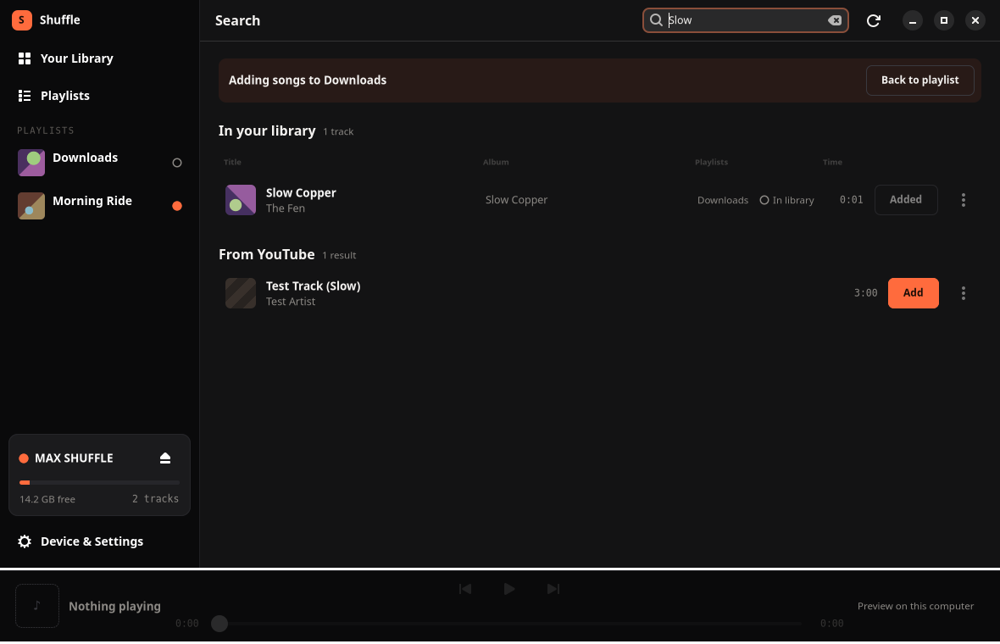

# Graphical interface

Start the application with:

```bash
./ipod-gui.sh
```

You can also start **iPod Shuffle** from the application grid after you run `./install.sh`.

The application finds the iPod automatically. It reads the device and music library on worker threads, so you can continue to use the window during a scan.

## Library states

**Your Library** combines configured music folders, cached previews, and tracks from the connected iPod.

| Marker | State | Meaning |
| --- | --- | --- |
| Filled | On iPod | The track is on the device |
| Ringed | Queued | The track is staged for the next sync |
| Hollow | In library | The track is on the computer but is not queued |
| Dashed | Previewed only | The track is in the preview cache |

An album is **On iPod** only when all its tracks are on the device. It is **Queued** only when the next sync will put all its tracks on the device. Use the track table when you need the state of each track.

You can group the grid by album or artist. You can also use a sortable track table. The application remembers the selected group and view.

## Queue and sync

Adding a track or album puts it in a queue. It does not copy the file immediately. The storage meter shows the pending size. Select **Sync** to copy all queued items and rebuild the device database once.

Select **Unqueue** to remove the source that added a track. For example, if a playlist queued the track, this action removes that playlist from the queue. Deleting a single local track removes only that track from the queue.

The sync bar shows each completed file and the database rebuild. These updates come from the scripts through the [structured progress interface](machine-interface.md#what-a-run-is-doing-while-it-is-doing-it).

## Remove or delete a track

Use the correct action for the location of the track:

- **Remove** deletes the copy on the iPod and rebuilds the database.
- **Delete from library…** moves a local file to the wastebasket. It does not delete the copy on the iPod.
- **Empty preview cache** removes cached previews.

The application refuses a local deletion when the volume has no usable wastebasket. It does not replace this operation with a permanent unlink.

## Music folders and device settings

Use **Device & Settings** to:

- Add or remove music folders.
- Review and clear the preview cache.
- Rebuild the iPod database.
- Wipe or eject the iPod.
- Review missing speech support.

The application enables spoken track and playlist names for each sync and rebuild. If no speech engine is available, a rebuild can remove existing generated names because the database builder clears and regenerates them. Install a speech engine before you change a device that already uses VoiceOver.

## Playlists

The application stores local playlists as M3U files in `~/Music/Playlists`.

You can:

- Create, rename, and delete a playlist.
- Add one track or a complete album.
- Select **Add songs** to search directly into the open playlist.
- Add a YouTube result after download.
- Move a track between playlists.
- Drag tracks into a new order.
- Select a custom JPEG, PNG, or WebP cover.

Playlist order is significant, so playlist tables do not have sortable columns.

Each playlist edit stages that playlist and its tracks for the next sync. You can edit playlists without an iPod. Select **Send to iPod** after you connect one.

Custom playlist covers are stored in `~/Music/Playlists/.covers`. They stay on the computer and do not use device storage.

### Playlists that exist only on the device

The application can display playlists that were created by another computer or by command-line folder and tag grouping. You can reorder or remove these playlists, but you cannot edit their tracks directly because their entries refer to files on the iPod.

Select **Copy to this computer** to create an editable local M3U. The application warns you if it cannot match all device tracks to local files. The tracks stay on the iPod whether you copy the playlist or not.

To import a playlist from another application, copy its `.m3u` file into `~/Music/Playlists` and refresh. Entries must identify files on this computer. Relative entries resolve from `~/Music/Playlists`. The interface does not import `.pls` files.

### VoiceOver names

The shuffle stores a playlist name only as generated speech. It does not store a text name in the playback database. A speech engine is therefore important for usable device playlists.

Renaming a playlist that is already on the iPod removes the old device playlist and stages the new name. The application refuses this operation when it cannot generate the replacement spoken name.

## Search and YouTube

The search field searches configured music folders. It matches query words across title, artist, and album in any order.

For queries with at least two characters, it also requests up to three YouTube results. You can paste a video or playlist URL into the same field. A finite playlist URL includes **Add all**. An unbounded channel or mix provides only per-track actions.

Local and YouTube searches fail independently. The relevant section reports an offline service, no matches, or a missing dependency. Local search continues to work when YouTube is unavailable.

When you select **Add songs** from a local playlist, the search page names that playlist as the destination. Local and YouTube **Add** actions put their results in that playlist. An **Added** action identifies a result that is already there. The Playlists column identifies playlist membership in track tables.



A YouTube search needs `yt-dlp`. A download also needs `ffmpeg` and a supported JavaScript runtime. See [YouTube downloads](youtube-downloads.md).

## Preview playback

Move the pointer over track artwork and select the play button to listen through the computer. Preview playback never controls playback on the shuffle.

The bottom bar provides play, pause, previous, next, and seek controls. Playback continues through the tracks in the currently displayed order and stops at the end of the queue.

Preview playback needs GStreamer. See [Preview playback packages](installation.md#preview-playback-packages).


## Preview and artwork caches

A YouTube preview downloads before playback. The default preview cache is:

```text
~/.cache/ipod-shuffle-linux/previews
```

The application removes old previews when the cache grows past 512 MB. It does not remove the track that is currently playing. Adding a preview moves it to `~/Music/youtube` and can queue it for sync.

Artwork is stored under `~/.cache/ipod-shuffle-linux/art`. Local tracks use embedded artwork. YouTube results use video thumbnails. Album and playlist views use track artwork when available.

Set `XDG_CACHE_HOME` to move both caches under a different cache root. Artwork and custom playlist covers do not go onto the iPod.
